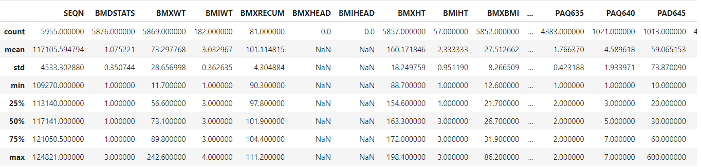
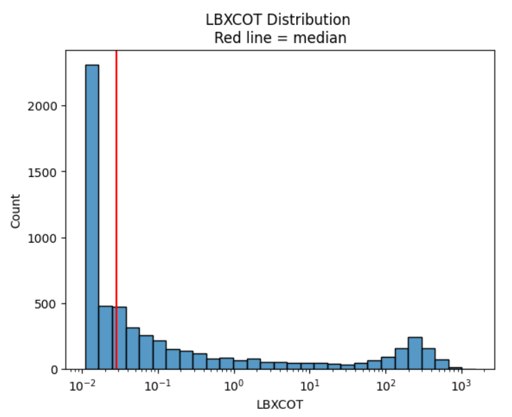
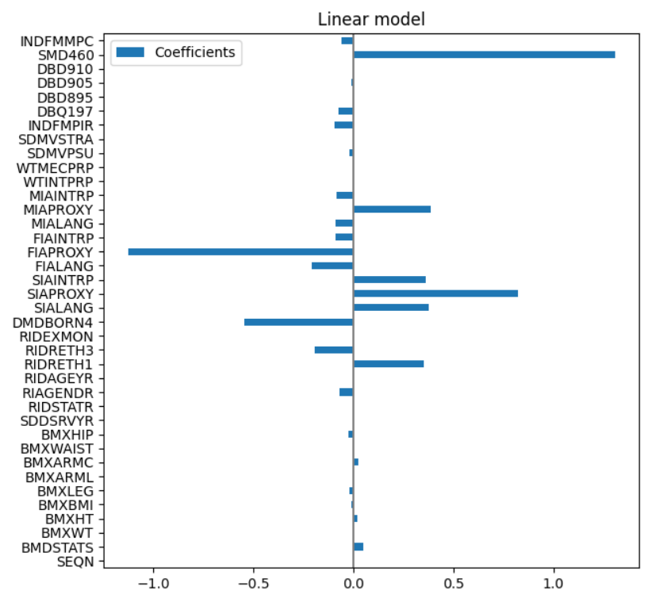

# Predicting Cotinine Levels in Non-Smokers using NHANES Data
By: Eric Andrews, Swathi Komarivelli, & Mike VerHulst

### The goal:
* Use machine learning models to predict cotinine levels (an indicator of secondhand smoke exposure)

### The tools:
* scikit-learn
    * Dummy regressor
    * Ridge and Lasso regression
    * Polynomial feature expansion
    * XGBooster Regressor
    * Zero-inflated regressor (Random Forest Classifier with Random Forest Regressor)
* Deepote
* seaborn

### Table of Contents
- [Intro](#introduction)
- [The Data](#data-source)
- [Methods](#methods)
- [Evaluation](#evaluation)
- [Discussion](#discussion)

### Introduction
The National Health and Nutrition Examination Survey (NHANES) is a nationwide program of studies designed by the Centers for Disease Control and Prevention (CDC) to review and assess the health and nutritional status of individuals in the United States. Including data collection on demographic, socioeconomic, dietary, and health-related features, NHANES is a constantly evolving program, changing its focus to meet the emerging needs of the country. One of these features is the levels of cotinine, a measure of secondhand smoke that is usually measured through blood tests. We aim to predict cotinine levels of non-smoking individuals based on various self-reported demographic and lifestyle factors

Our motivation to pursue this work comes from an interest in the capabilities of data science in the healthcare field to accurately extract useful insights that can benefit the population. Secondhand smoke exposure in people who do not smoke is linked to premature death, increased risk for stroke, heart attacks, and lung cancer (CDC 2021), making it an issue that early detection via machine learning can help in treating or mitigating exposure to secondhand smoke. Given that NHANES is a highly funded and expansive program with the ability to conduct blood tests on willing participants, the sizable amount of data they have collected is ideal for building a model to fulfill our goal of accurately predicting cotinine levels in non-smoking individuals.

### Data Source
The data used for our project was sourced from the CDC’s 2017-March 2020 (pre-pandemic) survey records, as they were the most recent results available. From these results, we incorporated demographic data, body measurements, current health status, diet behavior/nutrition, income, and physical activity.

For each survey cycle in NHANES, data is collected in two time periods. Half of the participants have their data collected from November 1st-April 30th, and the other half have their data collected from May 1st-October 30th. After ensuring that there were no considerable differences between the two datasets in an effort to preserve the integrity of our model, our team used the November 1st-April 30th data as our training data to create the model, and the second cycle as our final test data set to determine how well our model performed on unseen yet similar data.

### Methods
#### Preprocessing
We worked with 6 separate datasets from NHANES. After dropping any participants that had missing values for cotinine, we recoded missing value codes such as 77 and 99 to be NaNs so they were properly understood as missing by pandas. Starting the EDA, we started with 114 features. However, many features were largely empty or had the same value for every row. We dropped columns that had more than 20% of its values as missing. Additionally, we used sci-kit learn’s multivariate imputer to impute any missing values in the remaining features using the mean strategy. Looking at the outliers, we saw a wide range of values as cotinine measurements could be between 0.011 and 1820. Additionally, we noticed that our data was zero-inflated. Using a zero-inflated model such as sci-kit learn’s meta zero inflated regressor is something we considered during this EDA process. Because the distribution of the outcome was severely right-skewed, we also log-transformed this outcome so that it could be closer to a normal distribution.

The figure above shows how our target variable was very heavily zero-inflated.

#### Supervised Machine Learning Methods Used
In order to find the most optimal model, a number of different supervised learning methods were tested and evaluated based on the metrics chosen. Along with a basic Linear Regression model and Dummy Regressor used as baseline benchmark models, Linear Regressions with Lasso and Ridge regularization were tested, as well as Linear Regression with Polynomial Feature expansion, Gradient Boosting Regressors, and finally Zero-Inflated Regressors.

Based on the performance of these models, they were either discarded or further fine-tuned to achieve optimal results.

#### Feature Representation
We placed all of our features into one dataframe that would be used in our models. After pre-processing, our feature set had a total of 19 columns. Of these columns, 7 were numerical features and 12 were categorical.

#### Missing Value Treatment
We dropped any features that had more than 20% of its values missing and used sci-kit learn’s multivariate imputer to impute any missing values in the remaining features using the mean strategy.

#### Categorical Feature Encoding
The categorical features within our dataset came pre-encoded by the NCHS.

#### Feature Importance
We still had a large amount of features after pre-processing. As a result, we used our benchmark model, a simple Linear Regressor to determine initial important features. These ended up being family monthly poverty level, the # of people in a household who smoke tobacco, the # of ready-to-eat foods consumed in the past 30 days, past 30 day milk product consumption, ratio of family income to poverty, whether or not an interpreter was needed in the interview, the language the interview was conducted in, whether or not a proxy was used in the interview,  the country of birth, participant race and ethnicity, participant gender, arm circumference, hip circumference, leg circumference, and standing height.

#### Train-Test Split, Scaling, and Base Model Selection
For each survey cycle in NHANES, data is collected in two time periods. Half of the participants have their data collected from Nov 1- April 30, and the other half have their data collected from May 1- October 30. For this project we used the Nov 1-April 30 data as our training data for which and we used the May 1- October 30 cycle as our final test data. Splitting our data in this way allows us to determine how well our model performs on unseen yet similar data that occurs in the future. We split our data before even starting EDA, in order to ensure maximum avoidance of data leakage. We used MinMaxScaler from sci-kit learn to scale any of the important features that were continuous. We chose an untuned linear regression model as our base model selection as the model to try to outperform in our evaluation and model selection phase. The benchmark R-squared score we were trying to outperform was 26%, as well as a Mean Squared Error of 3.08 and a Mean Absolute Error of 1.17.

### Evaluation
#### Evaluation Metrics
For evaluation of our model we used the following metrics:  R-squared, root mean-squared error (RMSE), mean-squared error (MSE), and mean absolute error (MAE). Our benchmark regressor was a Linear Regression model run on the entire feature set before feature selection.

#### Main Results
Using our training and testing sets and the appropriate scaling of our features, a series of supervised learning models were ran and evaluated using the desired metrics:

**insert table**

Based on the results above, we conclude that with respect to all three key metrics, the Zero-Inflated Regressor produces the most optimal model of those tested, as all of the other models failed to produce better results than the baseline Linear Regression model. 

As for the tuning of the Zero-Inflated Regression Model, first a random forest classifier was trained that would decide whether the output was zero or not. Then, a random forest regressor with ‘log2’ max_features and ‘friedman_mse’ criterion was trained on the part of the data with a non-zero target. Feature importances would have been extracted from the model, but given it was a custom built model not built by scikit-learn, it did not have this functionality. 

### Discussion
#### What Interesting relationships or insights did you get from your analysis?
We saw that diet was an important predictive factor of secondhand smoke exposure, along with income, English fluency, and whether someone was born in a country outside of the U.S. However, housing type did not have this same significance - it would be thought that if someone lives in an apartment rather than a house, they could be exposed to the secondhand smoke of other tenants in the complex. However, this did not seem to be the case within our data.

#### What didn’t work, and why?
Trying to engineer features from the select important features such as averages or other statistical transformations of the existing features did not add any value. This is likely because we had to investigate the relationship between the actual features a bit more before engineering as they are all intertwined with each other - there could have been some collinearity at play. We also tried log transforming and using a Box-Cox transformation on our outcome in order to make it have a more normal distribution, but there were so many zeroes that it continued to stay as right-skewed as it was. This is likely because in any survey that has a random selection method, there will always be a chance of having a lot of zeroed out values. 

#### What surprised you about your results?
One thing that was a bit surprising about our results was the extremely poor performance of the linear regression with lasso regularization. Given the nature of lasso regularization, small values should have been zeroed out and more importance placed on larger coefficients, which, with our zero-inflated data set, presumably would have resulted in a better performance. We saw the opposite occur, with a basic linear regression and even ridge regression performing better than the lasso regression by a large margin.

#### How could you extend your solution with more time/resources? 
Although the zero-inflated regressor was the simplest choice in dealing with the distribution of our outcome, I think if we had more time we might try something more stacked along with the zero-inflated regressor. We also may have looked more closely at statistical analyses between the important features so as to determine a better set of features that we could engineer from these existing ones.

#### What ethical issues could arise in the course of this project work, or applying its results?
In regards to the ethical issues that could arise in the course of this project work, it can be said that one of the primary issues will be in preserving algorithmic transparency, and ensuring that bias was not introduced into the model. Although using income as a predictive feature has the potential to introduce some bias against lower income people in the context of insurance companies setting policy rates, there is a long history of income being an important indicator of tobacco use (CDC 2022). If our model was applied to help make health policy decisions, we would highly recommend that our model be one piece in a broader model to ensure as much context as possible about the affected populations is known before any final decisions are made. Finally, we would mention that our model would only be generalizable at a federal level and may not be appropriate to apply to individual cities or towns.
In a more broad sense, there are a number of additional ethical issues that exist when introducing machine learning into the healthcare field. In addition to the risk of furthering existing health inequities, there are also concerns surrounding data protection, considering healthcare data is particularly sensitive.
